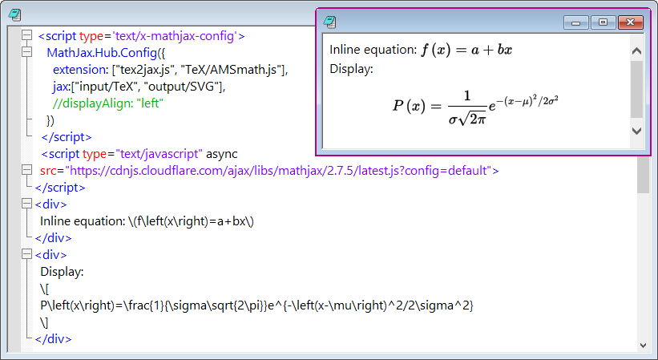

# Origin-Snippets

LabTalk, Python, Origin-C and HTML/JavaScript snippets to free you hands.

欢迎为Origin-Snippets提供功能改进、代码修补、bug反馈、使用文档和献计献策，让我们一起把Origin-Snippets做的更好！当然也欢迎你对Origin-Snippets项目进行捐助（可以使用支付宝或微信扫码）。


1. [LabTalk, Python and Origin-C](#labtalk-python-and-origin-c)
2. [HTML and JavaScript](#html-and-javascript)

## LabTalk, Python and Origin-C
1. [Stack Groups in Worksheet](#stack-groups-in-worksheet)
2. [Remove Links in Worksheet](#remove-links-in-worksheet)

### Stack Groups in Worksheet
LabTalk
```
int nGroups = 3;
int nFields = 3;
for(int i = 1; i <= nGroups; i++)
{
  for(int j = 1; j <= nFields; j++)
  {
    range src = [Book1]Sheet1!wcol((i-1)*nGroups+j);
    range dst = [Book2]Sheet1!wcol(j);
    copy -a src dst;
  }
}
```


### Remove Links in Worksheet
LabTalk
```
for(int i = 1; i <= wks.ncols; i++)
{
    range rr = !$(i);
    %A = [%H]%(wks.name$);
    dataset ds = %A!$(i);
    rr = ds;
}
```

## HTML and JavaScript

1. [Center Alignment for an Image](#center-alignment-for-an-image)

### Center Alignment for an Image
```

```

### MathJax
```
 <script type='text/x-mathjax-config'>
    MathJax.Hub.Config({
      extension: ["tex2jax.js", "TeX/AMSmath.js"],
      jax:["input/TeX", "output/SVG"],
      //displayAlign: "left"
    })
  </script>
  <script type="text/javascript" async
  src="https://cdnjs.cloudflare.com/ajax/libs/mathjax/2.7.5/latest.js?config=default">
</script>
<div>
  Inline equation: \(f\left(x\right)=a+bx\)
</div>
<div>
  Display:
  \[
  P\left(x\right)=\frac{1}{\sigma\sqrt{2\pi}}e^{-\left(x-\mu\right)^2/2\sigma^2}
  \]
</div>
```

